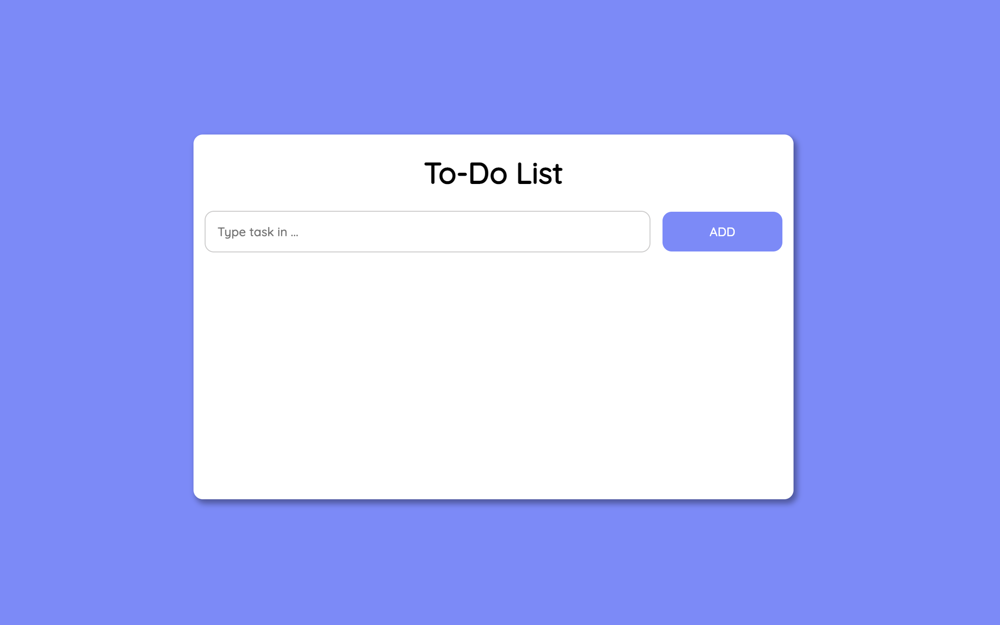

# To-Do List

## Table of contents

- [Overview](#overview)
  - [The challenge](#the-challenge)
  - [Screenshot](#screenshot)
  - [Links](#links)
- [My process](#my-process)
  - [Built with](#built-with)
  - [What I learned](#what-i-learned)
  - [Continued development](#continued-development)
  - [Useful resources](#useful-resources)

## Overview

### The goal

Users should be able to:

- add tasks to a list
- mark tasks as done or delete them
- see tasks after refreshing the page
- use the page offline

### Screenshot



### Links

- Live Site URL: https://chris-to-do-list.netlify.app/

## My process

1. Created an overview which features the To-Do List should have and how it should look like

2. Started bulding the page by adding a hedaline, inputfield and an "Add"-button.

3. Added following functions: 
                              - adding a list item when something is written down in the inputfiel and the "Add"-button is clicked
                              
                              - adding a "Trashcan"-button and "checkmarker"-button when a new list item is created
                              
4. Gave the background a colour and created a white rectangle around the all items. Also everything got positioned to the center of the page

5. Added following functions to the buttons: 

                              - "Add"-button: background colour, fitting padding etc. 
                                 When hovered --> lighter background colour.
                              
                              - "Trashcan"-button: imported trashcan icon and added the fitting class. Colour changed to red.
                                 When clicked --> deletes item
                                 
                              - "Checkmarker"-button: imported checkmarker icon and added the fitting class. Colour changed to green. 
                                 When clicked --> item colour = green
                                 
6. Used local storage to save the tasks, when the page gets refreshed. 

7. Converted the page to a PWA. 

### Built with

- Semantic HTML5 markup
- CSS custom properties
- Flexbox
- Javascript

### What I learned

Add class to items, when you click on them :

```js
doneButton.onclick = function() {
        li.classList.toggle("done");
    }
```

How to use local storage to save values from the inputfield:

```js
  deleteButton.addEventListener("click", (e) => {
        li.parentNode.removeChild(li);
        savedTasks = savedTasks.filter((e) => e !== txt); // remove the in-memory element
        localStorage.setItem("tasks", JSON.stringify(savedTasks)); // store the new list in localStorage
    })
   // read previous tasks. If no tasks were found, start with an empty list
  let savedTasks = JSON.parse(localStorage.getItem("tasks")) || []; 
  // add UI elements for any saved task
  savedTasks.forEach(createListElement);
  
  
  var addListAfterClick = () => {
	if (inputLength() > 0) {
        let txt = input.value;
        savedTasks.push(txt);
        localStorage.setItem("tasks", JSON.stringify(savedTasks));
        createListElement(txt);
	} else {
        alert("Please write something to do!");
    } 
```

### Continued development

In future projects I also want to make them store inputs and convert them into PWAs. 

### Useful resources

- [Youtube: dcode] (https://www.youtube.com/watch?v=k8yJCeuP6I8&t=643s) - This helped me saving inputs in the local storage and   
                                                                          to display them when the page gets reloded
                                                                          
- [Youtube: vaadinofficial](https://www.youtube.com/watch?v=E8BeSSdIUW4&list=WL&index=142) - This helped me to convert my web page into a PWA
